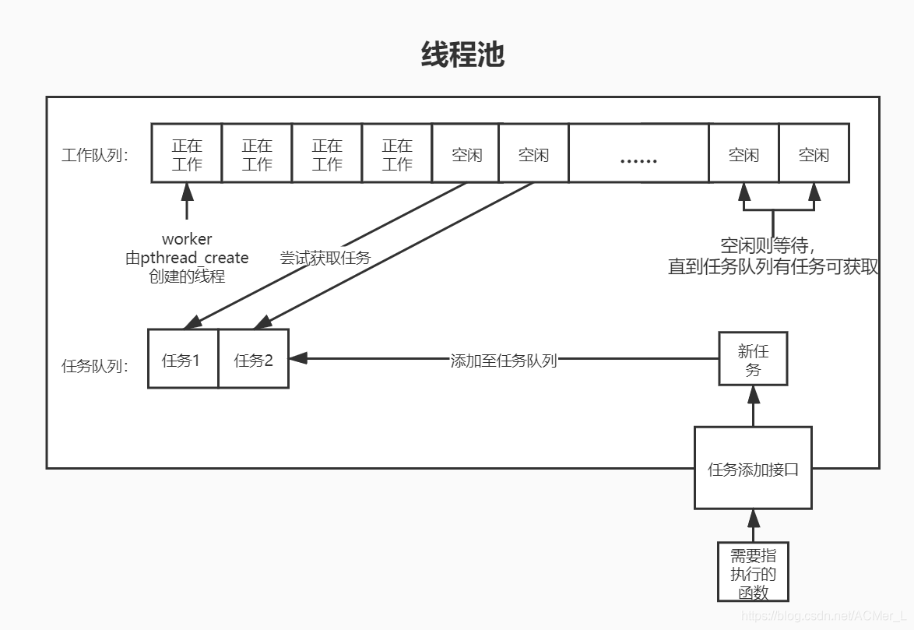

# 线程池
## 介绍
C++11加入了线程库
，从此告别了标准库不支持并发的历史。然而C++对于多线程的支持还是比较低级，稍微高级一点的用法都需要自己去实现，比如线程池、信号量等。线程池（thread pool）这个东西，一般在面试时的回答都是：“管理一个任务队列，一个线程队列，然后每次去一个任务分配给一个线程去做，循环往复。”这回答貌似没有问题，但是写起程序来的时候就出问题了。  

有什么问题？线程池一般是要复用线程，所以如果是取一个task分配给某一个thread，执行完之后再重新分配，在语言层面这是基本不能实现的：C++的thread都是执行一个固定的task函数，执行完之后线程也就结束了。所以该如何实现task和thread的分配呢？

- 让每一个thread创建后，就去执行调度函数：循环获取task，然后执行。

这个循环该什么时候停止呢？很简单，当线程池停止使用时，循环停止。这样一来，就保证了thread函数的唯一性，而且复用线程执行task。实现一个线程安全的SafeQueue原理很简单，利用mutex来限制并发访问即可。我们可以在SafeQueue类中定义一个std::mutex类型的成员变量，并在相应的操作接口（如入队接口enqueue()）中利用**互斥体包装器**来管理这个mutex，确保没有其他人正在访问该资源。

## 实现思路
<!-- - 一个简易的单任务队列线程池的实现思路：在线程池构造时初始化线程数，在析构时停止线程池。对外也只需要提供提交任务的接口就够了。 -->
总结一下，我们的线程池的主要组成部分有二：
- 任务队列（Task Queue）
- 线程池（Thread Pool）
线程池与任务队列之间的匹配操作，是典型的生产者-消费者模型，本模型使用了两个工具：一个mutex + 一个条件变量。mutex就是锁，保证任务的添加和移除（获取）的**互斥性**；一个条件变量保证多个线程获取task的**同步性**：当任务队列为空时，线程应该等待（阻塞）。

接下来我们就可以逐渐将一块块积木拼成一个完整的简易线程池。

### 积木1：任务队列（Task Queue）
我们会理所当然地希望任务以发送它相同的顺序来逐个执行，因此队列是最适合的数据结构。将任务队列单拿出来之后，我们应考虑一个问题：正如上一节提到的线程池task与thread的分配方法所示，线程池中的线程会持续查询任务队列是否有可用工作。当两个甚至多个线程试图同时执行查询工作时，这会引起难以估计的灾难。因而我们需要对C++的std::queue进行包装，实现一个**线程安全的SafeQueue**。

### 积木2：线程池（Thread Pool）
线程池是线程池模型的主体，我们将它拆成更小的部分来逐步分析，方便理解。
#### 2-1 提交函数
线程池最重要的方法就是负责向任务队列添加任务。我们的提交函数应该做到以下两点：

- 接收任何参数的任何函数。（普通函数，Lambda，成员函数……）
- 立即返回“东西”，避免阻塞主线程。这里返回的“东西”或者说“对象”应该包含任务结束的结果。

## 线程同步
一说到线程，那处理好线程同步就是一个绕不开的话题，那在线程池中我们需要处理的临界资源有哪些呢？想想我们工作队列中的每个worker都在等待一个任务队列看其是否有任务到来，所以很容易得出结论我们必须要在线程池中实现两把锁：一把是用来**控制对任务队列操作**的互斥锁，另一把是当任务队列**有新任务时唤醒worker的条件锁。**有了这两把锁，线程池中再加点必要的一些数字以及对线程池操作的函数，那么这个类就写完了。

## 实现细节
1. 有队伍进入队列时，仅需要notify_one()，避免无意义的线程竞争
2. 在停止线程池时，要notify_all()唤醒所有进程。由于线程在等待stop标志，所以当唤醒之后才会把队列中的任务取出执行直到队列为空的时候才会退出线程。
## 难处
1. c++-11的语法糖
2. task分配给某一个thread的语言方面障碍